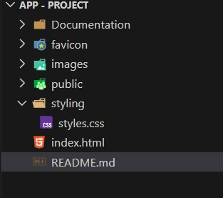

1. Project Title

 Website named: Visa Agency Solutions

2. Description

A responsive personal portfolio website built with HTML and CSS.
It showcases my projects, skills, Web Developemnt services, and contact information in a clean, accessible design.

3. Features

• Responsive design (mobile, tablet & desktop friendly)
• Accessible with proper semantic HTML and ARIA labels
• Sticky navigation bar and hamburger menu
• Custom branding and styling

4. Folder structure

5. Technologies Used

- HTML5
- Modern CSS (Flexbox, Grid, Media Queries)
- PHP on the contact form for email sending

- Hex Colors from Adobe Palette Color:

- Light Cream Background	(254, 246, 235)	#FEF6EB
- Dark Blue Header / Titles	(0, 54, 83)	#003653
- Deep Navy Text	(36, 43, 49)	#242B31
- Brown-Orange (Buttons, Icons)	(170, 97, 44)	#AA612C
- Peach / Card Background	(241, 221, 202)	#F1DDCA
- Warm Brown Accent	(207, 144, 92)	#CF905C

6. Accessibility & Best Practices

This site follows accessibility best practices:

- Semantic HTML tags
- Proper alt attributes for images
- Language attribute set to `en-GB`

7. Deployment

Live Demo: https://armel-nzawou-developer.github.io/ArmelDesign/

8. License

- This website is not an open source but private.
- This website is licensed under the owner's brand (ArmelDesign★).
